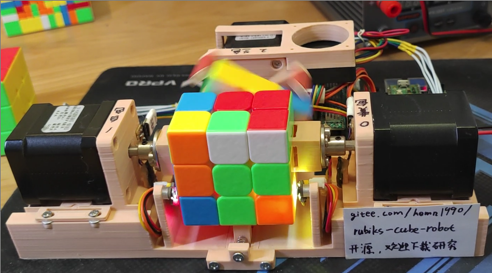

# 三阶魔方还原机器人

## 介绍
低成本魔方机器人设计，总物料成本200元左右。 含单片机源码（c语言）、结构图（openSCAD格式/STL格式）、主要器件BOM。 使用rp2040单片机控制，控制和魔方求解都使用单片机完成。 对于随机打乱的魔方，平均还原步骤数在21步左右，最坏情况22步。（后续计划优化到20步左右）


演示视频：video/VID_20220618_165444.mp4

21步版本的演示视频：http://www.bilibili.com/video/BV1Qt4y1476Y?share_medium=android&share_source=copy_link&bbid=XYF29BCF6DF22C72C26DED32037959465ED97&ts=1657889031274

## 关于硬件设计
将RP2040单片机的GPIO，任意连接到步进电机驱动器、颜色传感器、霍尔传感器即可。除了SPI、UART，其他引脚只用了GPIO，未使用其他复用功能。
霍尔传感器只能5V供电，RP2040单片机IO是3.3V，注意电平转换设计。

2022-07-07更新，SPEPPER_EN修改为GP2，添加SPI NAND FLASH 型号W25N01GVZEIG

2022-07-10更新，按键由GP0,GP1改为GP27,GP28)只修改了./src_21_step

FLASH是可选的，如果不使用FLASH，平均还原步骤数在32步左右。

参考GPIO分配方式如下：

#### 步进电机使能信号
- SPEPPER_EN    GP2
#### 步进电机控制信号
- SPEPPER_STEP0 GP11
- SPEPPER_DIR0  GP10
- SPEPPER_STEP1 GP9
- SPEPPER_DIR1  GP8
- SPEPPER_STEP2 GP7
- SPEPPER_DIR2  GP6
#### 霍尔开关，用于寻找零点
- HALL_0        GP5
- HALL_1        GP3
- HALL_2        GP4
#### 按键
- BUTTON_0      GP0(GP27)
- BUTTON_1      GP1(GP28)
#### 颜色传感器信号
- SDA0          GP14
- SCL0          GP15
- SDA1          GP12
- SCL1          GP13`
#### SPI NAND FLASH信号
- CS(1)         GP17
- DO(2)         GP16
- DI(5)         GP19
- CLK(6)        GP18


## 关于结构设计
1、使用**ABS材料**3D打印，尤其是夹魔方的结构件，对强度要求较高。


## 单片机固件编译(./src,平均还原步骤数在32步左右的版本，硬件上不需要外挂1Gbit FLASH)
推荐使用Linux系统进行开发，可按照官方文档中的脚本搭建开发环境。
不推荐Windows系统下搭建，坑很多的。

搭建好之后
````
cd src
mkdir build
export PICO_SDK_PATH=xxxxxxxx
cmake ..
make
````
然后找到cube_robot.uf2，刷写到RP2040单片机即可。

可以连接USB，使用minicom -D /dev/ttyACM0指令查看调试信息，例如：
````
color_detect: FLDFUUUDBDLRURRFDLBFRDFBFLRDDURDBBUBLURBLRLBLFFUFBLDRU
stage=0, D' B U' L F' 
stage=1, B2 R2 U2 F2 D R' L' U L' 
stage=2, R2 D' F2 D2 R2 D R2 D' B2 D' 
stage=3, B2 R2 U2 B2 U2 L2 U2 L2 F2 R2 B2 
````

## 单片机固件编译(./src_21_step,平均还原步骤数在21步左右的版本)

**生成查找表**，并且进行验证（可选步骤,prog_flash目录下提供生成好的）

运行完成后，得到lookup.dat,文件大小大约70MB
````
cd ./src_21_step/verify_on_pc
pypy3 prun.py
make
./solve
````

**编译单片机固件**
````
cd ./src_21_step/mcu
mkdir build
export PICO_SDK_PATH=xxxxxxxx
cmake ..
make
````
然后找到cube_robot.uf2，刷写到RP2040单片机即可。


**刷写SPI NAND FLASH**

连接电脑和RP2040的串口，注意线一定要短，波特率高达1Mbps。

按住BUTTON_0的同时给魔方机器人上电，程序会计算NAND FLASH的CRC32校验和，如果失败，自动进入少些模式

````
cd ./src_21_step/prog_flash
make
./prog /dev/ttyS0 # /dev/ttyS0改为电脑的串口号

````
运行prog的电脑终端出现如下调试信息，说明刷写成功。
````
mcu in SPI FLASH programming mode
Check lookup.dat CRC32 = A8093698
0, size=131072
Erase Block 0
Program Block 0 ................................................................
Verify Block CRC32 0................................................................
此处省略若干行...
Erase Block 565
Program Block 565 ................................................................
Verify Block CRC32 565................................................................

````


